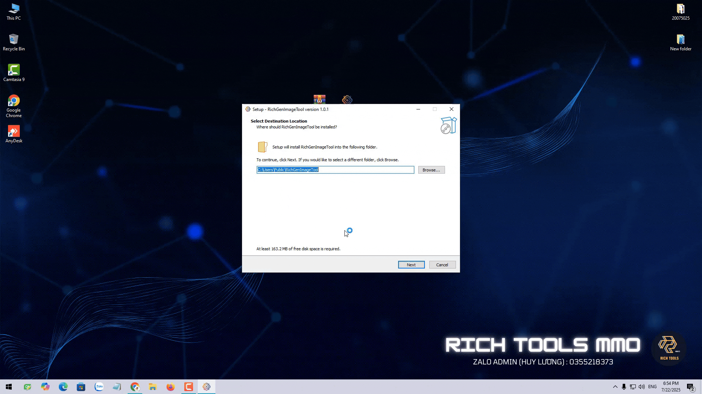
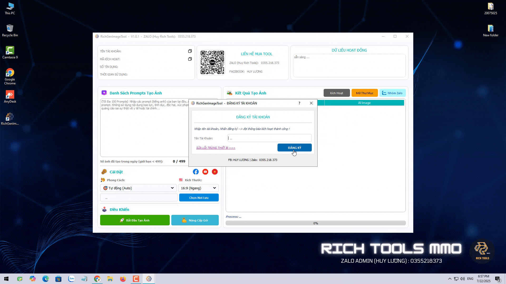

# 📸 Rick Gen Image Tool – Free Unlimited AI Image Generator

Welcome to **Rick Gen Image Tool**, a powerful and user-friendly software that lets you generate **AI images for free** – with **no limits** on how many images you can create.
#### Compatibility
- Well compatible with Windows 10 and 11.
  
This tool is perfect for:
- 🎬 YouTubers who need thumbnails and visuals  
- 🎵 TikTok creators looking for creative content  
- 🧠 Designers and marketers who need bulk AI images  
- 💡 Anyone experimenting with AI art

---

## ✨ Key Features

- 🖼️ **Create up to 100 AI images at once**
- ♾️ **No daily or monthly usage limits**
- 🎨 Choose from various art styles (Cartoon, Renaissance, Jesus, Medieval, etc.)
- 📐 Supports multiple aspect ratios:
  - 16:9 (YouTube)
  - 9:16 (TikTok)
  - 1:1 (Facebook & Instagram)
- 💾 Save generated images directly to your PC

---

## 🖼️ Sample Generated Image

---

## 🚀 How to Install

1. Download the installer from the project repository in this GitHub repo.
2. Extract the `.zip` file to any folder.
3. Double-click the installer file.
4. Click **Next** through the steps until installation completes.
5. Click **Launch Tool** and **Finish** to start using.

---

## 🧪 Free Trial

Every new user gets:
- **100 free credits** (1 credit = 1 image)
- **12 hours** of trial access
- Instant registration in just a few seconds

---

## 📌 Usage Instructions

1. Enter your desired image prompts (English only, up to 100 at a time).
2. Choose an art style that fits your theme.
3. Select image size/aspect ratio.
4. Pick an output folder on your computer.
5. Click **Start Generating** – and watch the magic happen!

> ⚠️ Note: Prompts must not contain violence, hate speech, or personal/private info.

---

## 📂 Output & Storage

After generation:
- Images will be saved in your chosen folder.
- You can preview results directly from the app.
- Your remaining credits and daily image count will be updated.

---

## 🤝 Community & Support

- WhatsApp: https://wa.me/84777286725
- Telegram: https://t.me/richsoftwaremmo

---

## 📽️ Video Guide

A complete tutorial is available (with step-by-step instructions).  
📺 [Link to video tutorial](#)

---

## 💬 Feedback & Contribution

If you have any ideas, bugs to report, or want to help improve this tool – feel free to open an issue or contact us.

---

We hope it becomes a helpful resource for your creative projects! 🌟
